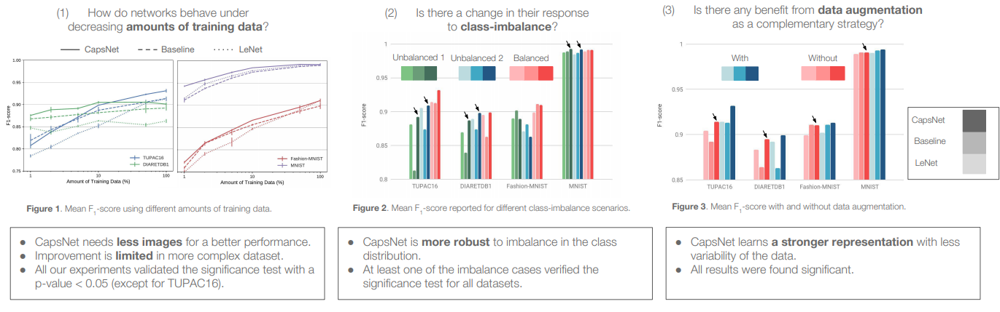
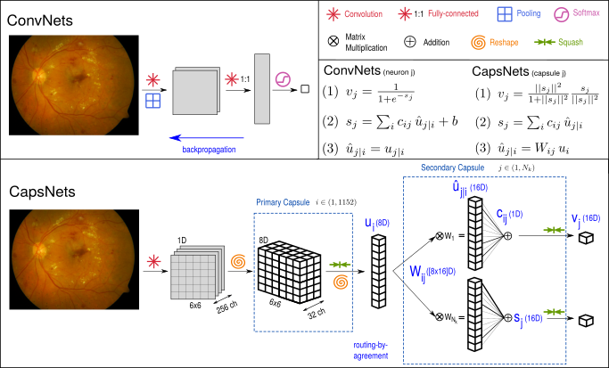
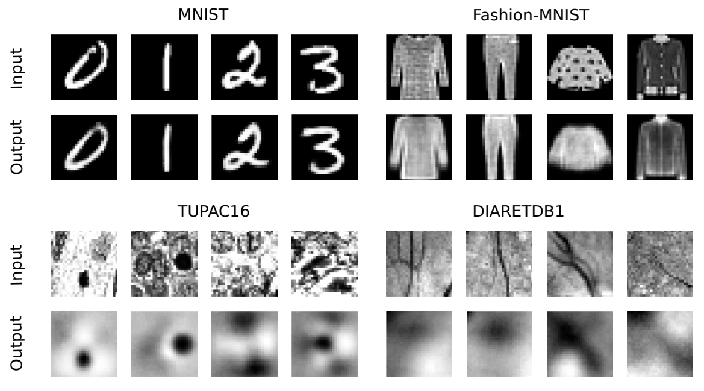

## Capsule Networks against Medical Imaging Data Challenges
#### by Amelia Jiménez-Sánchez, Shadi Albarqouni, Diana Mateus

This repository provides a TensorFlow implementation of our work -> [[**Paper**]](https://link.springer.com/chapter/10.1007%2F978-3-030-01364-6_17)
[[**arXiv**]](https://arxiv.org/abs/1807.07559#) [[**slides**]](https://ameliajimenez.netlify.com/files/labels18_slides.pdf)  [[**poster**]](https://ameliajimenez.netlify.com/files/labels18_poster.pdf)

## Overview 
In this paper, we experimentally demonstrate that the equivariance properties of [Capsule Networks](https://arxiv.org/abs/1710.09829) (CapsNets) reduce the strong data requirements, and are therefore very promising for medical image analysis. Focusing on computer-aided diagnosis (classification) tasks, we address the problems of limited amount of annotated data, imbalance of class distributions and data augmentation.
<!---We focus on analyzing their performance to answer the following questions:
* How do networks behave under decreasing amounts of training data?
* Is there a change in their response to class-imbalance?
* Is there any benefit from data augmentation as a complementary strategy?--->
Here there is a summary of our findings:

<p align="center"></p>

## Requirements:
- Python 3.5+
- TensorFlow 1.4+
- Sklearn
- OpenCV
- Spams
- Pandas
- Numpy

## Usage
### 1. Cloning the repository
```bash
$ git clone https://github.com/ameliajimenez/capsule-networks-medical-data-challenges.git
$ cd capsule-networks-medical-data-challenges/
```

### 2. Downloading datasets
For the two vision datasets (MNIST, Fashion-MNIST), it is enough to set `data_path` to `./data/mnist` or `./data/fashion`, respectively. Data will be downloaded only the first time.
<br />
For the two medical datasets: mitosis detection (TUPAC16) and diabetic retinopathy detection (DIARETDB1), first images have to be downloaded from their respective websited and after, patches are extracted and stored.
<br />
* Download the "Auxiliary dataset: mitoses" of [TUPAC16](http://tupac.tue-image.nl/node/3) from the Dataset section, and move all the folders to `raw_data/tupac16/`. Please note that you need to register on their website and login to be able to download the data.
* Download [DIARETDB1](http://www2.it.lut.fi/project/imageret/diaretdb1/#DOWNLOAD) dataset and move the content from `resources/images` into `raw_data/diaretdb1/`.

### 3. Pre-processing and extracting patches
Pre-processing consists of normalization using color deconvolution (stain normalization) and keeping the hematoxylin channel for TUPAC16, and applying contrast limited adaptive histogram equalization (CLAHE) on the lab color space and keeping only the green channel for DIARETDB1. By running the following scripts, patch extraction is performed and data is stored in `data` directory. The `augment` argument controls the use of data augmentation, you can set it to "True" or "False".
```bash
$ python preprocess_tupac16.py
$ python preprocess_diaretdb1.py
```

### 4. Loading the data
To perform experiments with **limited amount of data**, change the `percentage_train` argument.
For the **class-imbalance** experiments, set `unbalance` to `True` and define the imbalanceness by changing `unbalance_dict` argument.
To compare the performance with and without **data augmentation**, use the appropiate `data_path` for the medical datasets and for the vision ones (MNIST and Fashion-MNIST) set `augment` argument to `True`.
```bash
data_provider = read_datasets(data_path,
                              augment=False,
                              percentage_train=100.,
                              unbalance=False,  unbalance_dict={"percentage": 20, "label1": 0, "label2": 8})
```

### 5. Definition of the network
To select the desired architecture for training and test, define `net` in `train.py` and `test.py` respectively. Specify the number of classes in the classification problem with `n_class` and set `is_training` to `True` (training) or `False` (test). For example, for training a CapsNet with 10 classes.
```bash
net = capsnet.CapsNet(n_class=10, is_training=True)
```
please notice that `trainer` argument has to be changed accordingly.

<p align="center"></p>

### 6. Training
Specify the network as described in Step 5 and use `model_path` argument to store your models, e.g. `model_path = "./models/mnist/capsnet/"`.
```bash
$ python train.py
```

### 7. Test
To restore and test a model, define the network as described in Step 5 and from where models should be restored with `model_path` argument.
```bash
$ python test.py
```

### 8. Visualization of CapsNet
You can compare the input images and their reconstruction by visualizing them.
<br />
You can also modify the dimensions of the output vector of the secondary capsule to interpret the different dimensions.
```bash
$ python visualization.py
```

<p align="center"></p>

## Citation
If this work is useful for your research, please cite our [paper](https://link.springer.com/chapter/10.1007%2F978-3-030-01364-6_17):
```
@inproceedings{JimnezSnchez2018CapsuleNA,
  title={Capsule Networks Against Medical Imaging Data Challenges},
  author={Amelia Jim{\'e}nez-S{\'a}nchez and Shadi Albarqouni and Diana Mateus},
  booktitle={CVII-STENT/LABELS@MICCAI},
  year={2018}
}
```

## Acknowledgement
The code of Capsule Networks is based on the implementation by [@ageron](https://github.com/ageron/handson-ml/blob/master/extra_capsnets.ipynb).
